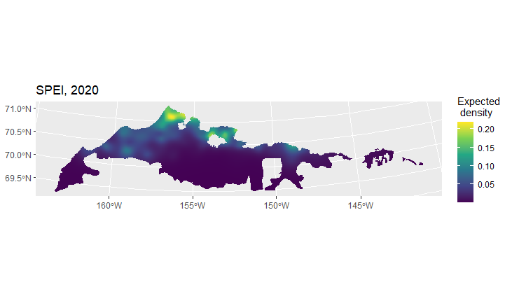

<!-- badges: start -->

<!-- For more info: https://usethis.r-lib.org/reference/badges.html -->

<!-- badges: end -->

# Arctic Coastal Plain Waterfowl and Waterbird Spatial and Temporal Trends

## Overview

This project aims to estimate spatial and temporal trends of waterfowl and waterbirds on the Arctic Coastal Plain (ACP) of Alaska from 2007 to present. The main approach is motivated by [Amundson et al. (2019)](https://doi.org/10.5751/ACE-01383-140118) using space-time generalized additive models (GAMs, Wood 2017) but with some improvements to handle observer effects and to associate sampling effort to specific spatial locations along a sampled transect similar to [Miller et al. (2013)](https://doi.org/10.1111/2041-210X.12105). As part of this effort, a major data quality control process was begun in March 2022 that led to the correction of many data errors and re-formatting of the original 2007 to 2023 data to make it more accessible and usable to outside partners (original raw data available [here](https://www.sciencebase.gov/catalog/item/65373af6d34ee4b6e05bb8c4)). Because of the errors present in the raw data, the newer data products associated with the project on this page should be distributed for use. The original raw data should not be used for population estimates, mapping, or trend analyses. Major data errors found include mislabeled transects, location points outside of North America, duplicate data observations, a transect numbering system that does not correspond to sample units, and etc. The full data quality control process is detailed in the R code file [ACPmapping.R](https://github.com/USFWS/ACP-Mapping/blob/main/ACPmapping.R) and new problems should be reported on the project GitHub site as issues or bugs ([link here](https://github.com/USFWS/ACP-Mapping/issues)). The data, including geographic polygon design files, have also been re-formatted and simplified to be easier to use, understand, and produce simple design-based population indexes. A major new data product is a geographic [lines data set](https://www.sciencebase.gov/catalog/item/65fcf1bcd34e64ff1548d749) that  connects transect start and end points and bird observations into lines that approximate airplane flight tracks to measure survey effort. This was necessary because the original flight tracks have been lost or have not been curated into usable products. These are needed because airplane flight paths often deviate from the designed transects due to weather or other factors. The full data set associated with this project is available [here](https://www.sciencebase.gov/catalog/item/65fcf153d34e64ff1548d744). 

Following [Miller et al. (2013)](https://doi.org/10.1111/2041-210X.12105), GAMs are fit to data assigned to transect segments, and after a process of model checking and development, relative density predictions are made across a grid (currently 750m cells) for each year after removing any effect of observer, which are treated as random effects. Currently, species detection is not incorporated in these predictions (as it is in Miller et al. 2019), so these are not strict density or population estimates but display the relative variation after statistically removing observer effects. From these predictions, relative density maps and associated uncertainty can be produced for any year, and population estimates can be made by summing predicted population size over the entire map or sub-region of interest, potentially incorporating a detection rate estimate. Population temporal trends for specific locations or the entire map are estimated as the geometric mean of expected population size over a specific time interval. Uncertainty is estimated by simulation from the posterior distribution of model parameters. Because the GAM estimate a continuous function in space and time, predictions can be made at any resolution or into unsampled locations (between transects) or unsampled years (2020). If the interpolation distance is nto too great, the model should provide reasonable estimates. 

  

*Spectacled eider relative density across the Arctic Coastal Plain in 2020 as predicted from a space-time GAM. Predictions are expected number of eiders per kilometer squared seen by an average observer.*

The main uses for these data products are for ESA Section 7 consultations and Species Status Assessments, as well as general avian distribution and trend maps. Harvest management is also based on some of these data, but as of 2023 those rely on design-based population estimates, which can easily be produced from the bird observation data in combination with transect design data. Because of the data quality errors discussed above, estimates documented in the Pacific Flyway Council Databook [available here](https://www.pacificflyway.gov/Documents.asp) or the USFWS Alaska Region 7 waterfowl [status memo](https://www.sciencebase.gov/catalog/item/64caee10d34e70357a355a17), or historical estimates reported in the R package [AKaerial](https://github.com/USFWS/AKaerial) will not match estimates obtained from this version of the data (as of 2024). Please report any data errors or quality issues [on this GitHub page](https://github.com/USFWS/ACP-Mapping/issues).  

Currently only for the spectacled eider has a GAM been fit and predicted densities estimated. Other species will be added as time or demand allow. If there is a specific request, contain the project maintainer or submit an issue. 

Amundson, C. L., P. L. Flint, R. A. Stehn, R. M. Platte, H. M. Wilson, W. W. Larned and J. B. Fischer. 2019. Spatio-temporal population change of Arctic-breeding waterbirds on the Arctic Coastal Plain of Alaska. Avian Conservation and Ecology 14(1):18, https://doi.org/10.5751/ACE-01383-140118

Miller, D. L., Burt, M. L., Rexstad, E. A., & Thomas, L. (2013). Spatial models for distance sampling data: recent developments and future directions. Methods in Ecology and Evolution, 4(11), 1001-1010, https://doi.org/10.1111/2041-210X.12105

Wood, S.N. (2017) Generalized Additive Models: An Introduction with R (2nd edition). Chapman and Hall/CRC.

## Installation

R v4.3.1 or higher is required. Necessary packages are documented in code files. 

## Usage

Code is presented only for documentation purposes. Download individual code files and data to a local directory, then run using R v4.3.1. Documentation for R functions and scripts are mostly presented as comments in the code files. 

The file [ACPmapping.R](https://github.com/USFWS/ACP-Mapping/blob/main/ACPmapping.R) is the main block of code that documents the data error discovery process, the fixes, and produces new data files. These include: bird observations, geographic survey area polygons, geographic transect lines, and approximate flight line paths. Bird observation are distributed as a single CSV, and geographic files are distributed as SQLite [GeoPackage databases](https://www.geopackage.org/) at [ScienceBase](https://www.sciencebase.gov/catalog/item/65fcf153d34e64ff1548d744). A zip folder containing all data, data products, and metadata is available at the link above. 

The file [map_eiders.R](https://github.com/USFWS/ACP-Mapping/blob/main/map_eiders.R) documents developmental code used to explore models and maps for spectacled and Steller's eider. The file [map_density_functions.R](https://github.com/USFWS/ACP-Mapping/blob/main/map_density_functions.R) contains various helper functions to fit models, make maps, and produce population estimates from a fitted GAM model. The files of the structure fit_[four letter code].R, e.g. [fit_SPEI.R](),  contain the species-specific model development and checking and write a fitted GAM object to a .RDS file that is then saved and used for predictions. As shown by [Amundson et al. (2019)](https://doi.org/10.5751/ACE-01383-140118) model fit details tend to differ somewhat for each species; thus, the development process is documented separately. The file [write_map.R]() reads the .RDS model object, and produces density estimates and writes predictions to an SQLite [GeoPackage database](https://www.geopackage.org/). Importantly, this database contain a data table with the git commit information identifying the code version (date, time, ssh hash, name and email) that was used to create density estimates. 

**These files will change frequently over time as model development is ongoing.**   

## Getting help

Contact [Erik Osnas](mailto:Erik_Osnas@fws.gov) for questions about this repository, source data, data products, or to report bugs or data errors. 

## Contribute

Contact the project maintainer for information about contributing to this repository. Submit a [GitHub Issue](https://github.com/USFWS/ACP-Mapping/issues) to report bug, request a feature or enhancement, or to report a data quality problem.
