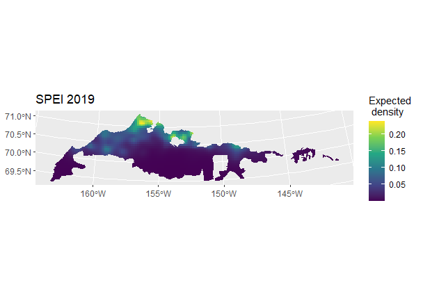

<!-- badges: start -->

<!-- For more info: https://usethis.r-lib.org/reference/badges.html -->

<!-- badges: end -->

# Arctic Coastal Plain Waterfowl and Waterbird Spatial and Temporal Trends

## Overview

This project aims to estimate spatial and temporal trends of waterfowl and waterbirds on the Arctic Coastal Plain (ACP) of Alaska from 2007 to present. The main approach is motivated by [Amundson et al. (2019)](https://doi.org/10.5751/ACE-01383-140118) using space-time generalized additive models (GAMs, Wood, 2017) but with some improvements to handle observer effects and to associate sampling effort to specific spatial locations along a sampled transect similar to [Miller et al. (2013)](https://doi.org/10.1111/2041-210X.12105). As part of this effort, a major data quality control process was begun in March 2022 that led to the correction of many data errors and re-formatting of the raw 2007 to 2023 data (available at [here](https://www.sciencebase.gov/catalog/item/65373af6d34ee4b6e05bb8c4)) to make it more accessible and usable to outside partners. Because of the errors present in the raw data, the data products associated with this project should be distributed for use and the original raw data should not be used for population estimates or trend analyses. Major data errors found include mislabeled transects, location points outside of North America, duplicate data observations, a transect numbering system that does not correspond to sample units, and etc. The full data quality control process is detailed in the R code file [ACPmapping.R](https://github.com/USFWS/ACP-Mapping/blob/main/ACPmapping.R) and new problems should be reported on the project GitHub site as issues or bugs [link here](https://github.com/USFWS/ACP-Mapping/issues). The data, including geographic polygon design files, have also been re-formatted and simplified to be easier to use, understand, and produce simple design-based population indexes. A major new data product is a geographic [lines data set]() that  connects transect start and end points and bird observations into lines that approximates airplane flight tracks to measure survey effort. This was necessary because the original flight tracks have been lost or have not been curated into usable products. These are needed because airplane flight paths often deviate from the designed transects due to weather or other factors.

GAMs are fit to observed data for each focal species, and after a process of model checking and development, density predictions are made across a grid (currently 6km^2 cells) for each year after removing any effect of observer, which are treated as random effects. From this, density prediction maps and associated uncertainty can be produced for any year, and population estimates can be made by summing predicted population size over the entire map or sub-region of interest. Population temporal trends for specific locations or the entire map are estimated as the geometric mean of expected population size over a specific time interval. Uncertainty is estimated by simulation from the posterior distribution of model parameters.

  

*Spectacled eider density across the Arctic Coastal Plain in 2019 as predicted from a spatial GAM. Predictions are expected number of eiders per kilometer squared.*

The main uses for these data products are for ESA Section 7 consultations and Species Status Assessments, as well as general avian distribution and trend maps. Harvest management is also based on some of these data, but as of 2023 those rely on design-based population estimates, which can easily be produced from the bird observation data. Because of the data quality errors discussed above, estimates documented in the Pacific Flyway Council Databook [available here](https://www.pacificflyway.gov/Documents.asp) or the USFWS Alaska Region 7 waterfowl [status memo](https://www.sciencebase.gov/catalog/item/64caee10d34e70357a355a17), or historical estimates reported in the R package [AKaerial](https://github.com/USFWS/AKaerial) will not match estimates obtained from this version of the data (as of 2024). Please report any data errors or quality issues [on this GitHub page](https://github.com/USFWS/ACP-Mapping/issues).  

Amundson, C. L., P. L. Flint, R. A. Stehn, R. M. Platte, H. M. Wilson, W. W. Larned and J. B. Fischer. 2019. Spatio-temporal population change of Arctic-breeding waterbirds on the Arctic Coastal Plain of Alaska. Avian Conservation and Ecology 14(1):18, https://doi.org/10.5751/ACE-01383-140118

Miller, D. L., Burt, M. L., Rexstad, E. A., & Thomas, L. (2013). Spatial models for distance sampling data: recent developments and future directions. Methods in Ecology and Evolution, 4(11), 1001-1010, https://doi.org/10.1111/2041-210X.12105

Wood, S.N. (2017) Generalized Additive Models: An Introduction with R (2nd edition). Chapman and Hall/CRC.

## Installation

R v4.3.1 or higher is required. Necessary packages are documented in code files. 

## Usage

Code is presented only for documentation purposes. Download individual code files and data to a local directory, then run using R v4.3.1. 

The file [ACPmapping.R](https://github.com/USFWS/ACP-Mapping/blob/main/ACPmapping.R) is the main block of code that documents the data error discovery process, the fixes, and produces new data files. These include: bird observations, geographic survey area polygons, geographic transect lines, and approximate flight line paths. Bird observation are distributed as a single CSV, and geographic files are distributed as GeoPackages at [ScienceBase](https://www.sciencebase.gov/catalog/item/645bfee5d34ec179a83822eb).  

The file [map_density.R](https://github.com/USFWS/ACP-Mapping/blob/main/map_density.R) is largely a work in progress, but as of the initial commit in 2024, this file documents the data exploration, model checking, and production of density maps produced for the spectacled eider. It also contains various helper functions to fit models, make maps, and produce population estimate from a fit GAM model. These files will change frequently over time as model development is ongoing.   

## Getting help

Contact [Erik Osnas](mailto:Erik_Osnas@fws.gov) for questions about this repository, source data, data products, or to report bugs or data errors. 

## Contribute

Contact the project maintainer for information about contributing to this repository. Submit a [GitHub Issue](https://github.com/USFWS/ACP-Mapping/issues) to report bug, request a feature or enhancement, or to report a data quality problem.
